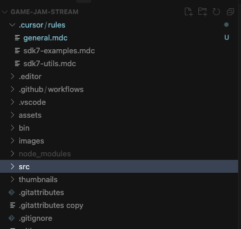

# Decentraland SDK7 Cursor Rules

These files can help an AI agent using the Cursor IDE to better understand code from a Decentraland scene and be more effective in its modifications.

To use this, copy the `/rules` folder into your project under a `.cursor` folder. It should look something like this:

**Disclaimer**: AI tools may generate code that is invalid, inferring functions, parameters, or components that don't exist in the Decentraland SDK. Be mindful of that, and when in doubt refer to the [Decentraland documentation](https://docs.decentraland.org/) always as the final source of truth.